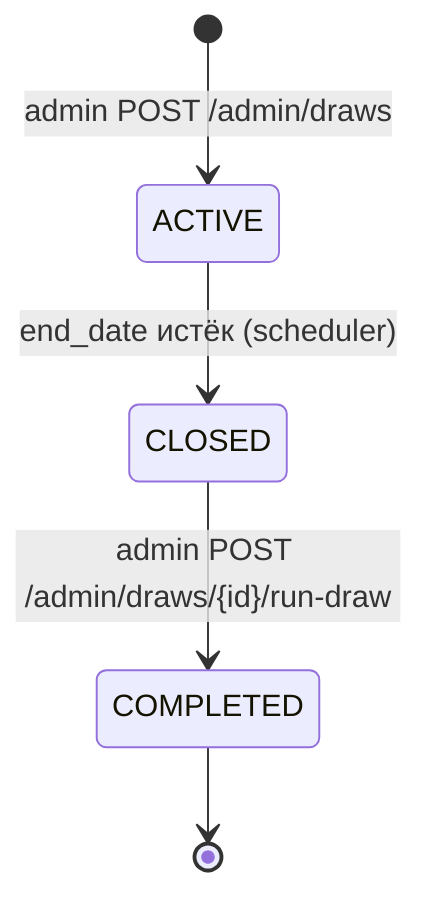

# lottery-backend

Бэкенд лотерейной системы на Java + Javalin + PostgreSQL.
Учебный проект, кейс «Лотерея».

---

## Команда 21

- Полубояров Валерий
- Кондратьев Алексей
- Костин Марк
- Беликов Иван
- Курындин Владимир
- Граблевский Михаил

---

## Реализованный сценарий

**Сценарий 1 — базовая лотерея.** Все обязательные функции:

- Аутентификация пользователей (USER / ADMIN), сессии через Bearer-токены
  (UUID, хранятся in-memory в процессе приложения).
- Создание тиражей администратором (билеты пред-генерируются в статусе
  `AVAILABLE`).
- Получение списка активных тиражей (`GET /draws?status=ACTIVE`).
- Покупка билетов пользователем (`POST /draws/{id}/tickets`).
  ADMIN покупать билеты не может — намеренное ограничение, чтобы исключить
  конфликт интересов (админ управляет тиражами).
- Закрытие продажи билетов автоматически по `end_date`. Период опроса
  настраивается через `DRAW_SCHEDULER_INTERVAL_SECONDS` (дефолт 30 сек).
- Проведение розыгрыша администратором по API (`POST /admin/draws/{id}/run-draw`).
- Получение результата тиража (`GET /draws/{id}/result`) и статусов билетов
  (`WIN` / `LOSE`) в `GET /me/results`.

**Бонусная функциональность:**

- Отчёт по завершённым тиражам — `GET /admin/reports/draws/completed`,
  выгрузка JSON или CSV (`?format=json|csv`).

---

## Стек

- **Java 17** (toolchain в Gradle)
- **Gradle Wrapper** + Shadow plugin (fat-jar)
- **Javalin 7.1** — HTTP-сервер. Без Spring / Spring Boot, как требует ТЗ.
- **PostgreSQL 16** + native ENUM-типы (`user_role`, `draw_status`, `ticket_status`)
- **HikariCP 7** — пул соединений
- **Flyway 12** — миграции, накатываются из кода при старте
- **Jackson 2.21** — JSON и CSV (для отчётов)
- **JBCrypt 0.4** — хеширование паролей
- **JDBC-only**, без ORM. Все запросы — `PreparedStatement` руками.
- **Bearer-токены — UUID, in-memory** (`ConcurrentHashMap` в `TokenService`).
- Тесты: JUnit 5, AssertJ, Mockito, **Testcontainers**, REST Assured

---

## Требования

- JDK 17+
- Docker + Docker Compose

---

## Запуск

```bash
docker compose up -d --build
```

Приложение: `http://localhost:8080`. Health-check: `GET /health`.

В БД при первом старте создаётся администратор:
`login=admin`, `password=admin123` (см. `V2__seed_admin.sql`).

Остановить:
```bash
docker compose down
```

С полным сбросом данных:
```bash
docker compose down -v
```

---

## Демо-стенд в браузере

После старта приложения по адресу `http://localhost:8080/api-demo.html`
доступна интерактивная HTML-страница: можно прокликать весь сценарий,
не подымая Postman / curl.

Покрыто на стенде:

- **Happy path:** логин админа → создание тиража → регистрация и логин пользователя → 
  покупка билета → автоматическое закрытие тиража по end_date → розыгрыш → результаты → 
  отчёт (JSON и CSV).
- **Негативные сценарии:** logout → старый токен возвращает 401, USER в
  admin-ручке возвращает 403, ADMIN пытается купить билет → 403, покупка
  без `Authorization` → 401.

Статика лежит в `src/main/resources/public/`:

```
public/
├── api-demo.html
├── css/api-demo.css
└── js/api-demo.js
```

---

## Переменные окружения

Все параметры имеют дефолты в `src/main/resources/application.properties` и
перекрываются ENV. **Для запуска через `docker compose` все значения уже
проставлены в `docker-compose.yml`** (см. `services.app.environment`) — таблица
ниже нужна, только если запускаете приложение вне Docker.

| ENV | Назначение | Дефолт (без Docker) |
|---|---|---|
| `APP_PORT` | Порт HTTP | `8080` |
| `DB_URL` | JDBC URL Postgres | `jdbc:postgresql://localhost:5433/lottery` |
| `DB_USER` | Пользователь БД | `lottery` |
| `DB_PASSWORD` | Пароль БД | `lottery_dev_password` |
| `DB_POOL_SIZE` | Размер пула Hikari | `10` |
| `BCRYPT_COST` | Стоимость BCrypt | `12` |
| `DRAW_SCHEDULER_INTERVAL_SECONDS` | Период опроса просроченных тиражей | `30` |

`DB_URL` указывает на `localhost:5433` именно для локального запуска без
Docker — порт 5433 проброшен с контейнера `db` на хост, чтобы не
конфликтовать с локально установленным Postgres. Внутри compose-сети
приложение ходит к `db:5432` (это значение и проставлено в
`docker-compose.yml`).

---

## Архитектура

Package-by-feature: фичи `users`, `draws`, `ticket`, `reports` лежат в своих
пакетах со всеми слоями. Общая инфраструктура — в `common/` и `config/`.

```
src/main/java/com/team/lottery/
├── Application.java              ← entry point + composition root (startWith)
├── config/
│   ├── AppConfig.java             ← properties + ENV → record
│   ├── DatabaseConfig.java        ← Hikari + Flyway
│   └── JavalinConfig.java         ← Javalin + Jackson + ErrorHandler
├── common/
│   ├── errors/                    ← ApiException + 5 наследников + ErrorHandler
│   ├── validation/Validators.java ← примитивы (notBlank, minLen, ...)
│   ├── db/Tx.java                 ← хелпер для транзакций (Tx.execute)
│   ├── web/RequestParams.java     ← парсинг path/query
│   └── health/HealthController.java
├── users/
│   ├── controller/ (AuthController, UserController)
│   ├── service/    (AuthService, TokenService)
│   ├── repository/ (UserRepository интерфейс + UserJdbcRepository)
│   ├── model/      (UserAuthData, UserResponse — records)
│   ├── dto/        (RegisterRequest, LoginRequest — records)
│   ├── validation/AuthValidators.java
│   └── util/PasswordUtil.java
├── draws/
│   ├── controller/ (DrawController, AdminDrawController)
│   ├── service/    (DrawService)
│   ├── repository/ (DrawRepository + DrawJdbcRepository, DrawResultRepository + DrawResultJdbcRepository)
│   ├── model/      (Draw, DrawResult — records; DrawStatus enum)
│   ├── dto/        (CreateDrawRequest, DrawResponse, DrawResultResponse — records)
│   ├── mapper/DrawMapper.java
│   ├── validation/DrawValidators.java
│   └── scheduler/DrawScheduler.java
├── ticket/
│   ├── controller/ (TicketController)
│   ├── service/    (TicketService)
│   ├── repository/ (TicketRepository + TicketJdbcRepository)
│   ├── model/      (Ticket — record; TicketStatus enum)
│   ├── dto/        (TicketResponse, BuyTicketResponse — records)
│   └── mapper/TicketMapper.java
└── reports/
    ├── controller/ (ReportController)
    ├── repository/ (ReportRepository + ReportJdbcRepository)
    └── dto/        (DrawReportEntry — record)
```

**Слои:** `Controller` → `Service` → `Repository`. Контроллеры тонкие
(парсинг + вызов сервиса). Бизнес-логика и валидация — в сервисах.
Репозитории — голый JDBC через интерфейс + JDBC-реализацию.

---

## Модель данных

4 таблицы + 3 PostgreSQL ENUM. Полная схема в
`src/main/resources/db/migration/V1__init_schema.sql`.

```
users         (id, login, password_hash, role[USER|ADMIN], created_at)
draws         (id, title, status[ACTIVE|CLOSED|COMPLETED], end_date, total_tickets,
               created_by → users.id, created_at)
tickets       (id, draw_id → draws.id, owner_id → users.id, ticket_number,
               status[AVAILABLE|SOLD|WIN|LOSE], created_at)
draw_results  (id, draw_id → draws.id UNIQUE, winning_ticket_id → tickets.id, drawn_at)
```

### Жизненный цикл тиража



- **ACTIVE** — тираж создан администратором. Билеты пред-сгенерированы в
  статусе `AVAILABLE`, пользователи могут их покупать.
- **CLOSED** — наступила `end_date`, шедулер автоматически закрыл продажу.
  Купить новый билет уже нельзя; тираж ждёт явного запуска розыгрыша.
- **COMPLETED** — администратор провёл розыгрыш. Победитель определён,
  статусы билетов обновлены, в `draw_results` записан выигрышный билет.

### Жизненный цикл билета

- **AVAILABLE** — билет сгенерирован вместе с тиражом, никем не куплен.
- **SOLD** — пользователь купил билет (атомарный переход
  `AVAILABLE → SOLD` с проставлением `owner_id`, защищён `FOR UPDATE SKIP LOCKED`
  от двойной покупки).
- **WIN** — на этот билет выпал выигрыш при розыгрыше. Если победил
  непроданный билет (правило лотереи допускает) — `owner_id = null`.
- **LOSE** — билет был `SOLD`, но не выиграл; после розыгрыша становится
  `LOSE`.

---

## API

### Публичные

| Метод | Путь | Описание |
|---|---|---|
| `GET` | `/health` | health-check |
| `GET` | `/health/db` | проверка БД |
| `POST` | `/auth/register` | регистрация |
| `POST` | `/auth/login` | логин (возвращает токен) |
| `POST` | `/auth/logout` | логаут (требует токен) |
| `GET` | `/draws` | список тиражей (можно `?status=ACTIVE`) |
| `GET` | `/draws/{id}` | тираж по id |
| `GET` | `/draws/{id}/result` | результат тиража (только для COMPLETED) |

### Для USER (требует `Authorization: Bearer <token>`)

| Метод | Путь | Описание |
|---|---|---|
| `GET` | `/users/me` | текущий пользователь |
| `POST` | `/draws/{id}/tickets` | купить билет в тираже (только USER, ADMIN получает 403) |
| `GET` | `/me/tickets` | мои билеты |
| `GET` | `/me/results` | мои билеты со статусом WIN/LOSE |

### Для ADMIN (требует токен админа)

| Метод | Путь | Описание |
|---|---|---|
| `POST` | `/admin/draws` | создать тираж |
| `POST` | `/admin/draws/{id}/run-draw` | провести розыгрыш (только для CLOSED, см. правило ниже) |
| `GET` | `/admin/reports/draws/completed` | отчёт по завершённым тиражам (`?format=json\|csv`, дефолт `json`) |
| `GET` | `/users` | список всех пользователей |
| `GET` | `/admin/ping` | проверка прав админа |
| `GET` | `/admin/logged-in-users` | активные сессии |

**Правило розыгрыша.** Победитель выбирается случайно среди **всех билетов
тиража**, включая непроданные. Для выбора выигрышного билета используется SecureRandom. 
Если победил непроданный билет — он переходит в `WIN` с `owner_id = null` (правило лотереи это допускает).
Розыгрыш блокируется (`409 CONFLICT`) только когда ни один билет в тираже
не куплен.

Любая ошибка возвращается единым форматом:

```json
{ "code": "VALIDATION_FAILED", "message": "endDate must not be in the past" }
```

Возможные коды: `VALIDATION_FAILED` (400), `UNAUTHORIZED` (401),
`FORBIDDEN` (403), `NOT_FOUND` (404), `CONFLICT` (409).

---

## Примеры запросов

### 1. Логин администратором
```bash
curl -X POST http://localhost:8080/auth/login \
     -H 'Content-Type: application/json' \
     -d '{"login":"admin","password":"admin123"}'
# 200 OK
# {"login":"admin","id":1,"token":"<UUID>","role":"ADMIN","message":"Login successful"}
```

### 2. Регистрация и логин пользователя
```bash
curl -X POST http://localhost:8080/auth/register \
     -H 'Content-Type: application/json' \
     -d '{"login":"alice","password":"supersecret123"}'
# 201 Created — {"id":2,"login":"alice","message":"User registered successfully"}

curl -X POST http://localhost:8080/auth/login \
     -H 'Content-Type: application/json' \
     -d '{"login":"alice","password":"supersecret123"}'
# 200 OK — {"token":"<UUID>","role":"USER",...}
```

### 3. Создание тиража админом
```bash
curl -X POST http://localhost:8080/admin/draws \
     -H 'Authorization: Bearer <ADMIN_TOKEN>' \
     -H 'Content-Type: application/json' \
     -d '{"title":"Holiday Draw","totalTickets":100,"endDate":"2027-12-31T23:59:00+03:00"}'
# 201 Created — {"id":1,"title":"Holiday Draw","status":"ACTIVE","totalTickets":100,...}
```

### 4. Покупка билета пользователем
```bash
curl -X POST http://localhost:8080/draws/1/tickets \
     -H 'Authorization: Bearer <USER_TOKEN>'
# 200 OK
# {"message":"Ticket purchased successfully","ticket":{"id":1,"status":"SOLD","ownerId":2,...}}
```

### 5. Список ACTIVE тиражей
```bash
curl http://localhost:8080/draws?status=ACTIVE
```

### 6. Розыгрыш (после того как шедулер закрыл тираж по end_date)
```bash
curl -X POST http://localhost:8080/admin/draws/1/run-draw \
     -H 'Authorization: Bearer <ADMIN_TOKEN>'
# 200 OK — {"id":1,"status":"COMPLETED",...}
```

### 7. Результат тиража и мои выигрыши
```bash
curl http://localhost:8080/draws/1/result
# {"drawId":1,"winningTicketId":42,"drawnAt":"..."}

curl http://localhost:8080/me/results -H 'Authorization: Bearer <USER_TOKEN>'
# [{"id":1,"status":"LOSE",...}, ...]
```

### 8. Отчёт по завершённым тиражам (admin, JSON или CSV)
```bash
# JSON (дефолт): массив записей по всем COMPLETED-тиражам
curl http://localhost:8080/admin/reports/draws/completed \
     -H 'Authorization: Bearer <ADMIN_TOKEN>'
# 200 OK
# [{"drawId":1,"title":"Holiday Draw","totalTickets":100,"soldTickets":74,
#   "winnerTicketNumber":42,"winnerUserId":2,"winnerLogin":"alice",
#   "drawnAt":"...","createdByAdminId":1,"createdByAdminLogin":"admin", ...}]

# CSV: качаем как файл (имя — completed-draws-YYYYMMDD-HHmm.csv)
curl -OJ http://localhost:8080/admin/reports/draws/completed?format=csv \
     -H 'Authorization: Bearer <ADMIN_TOKEN>'
```
Поля `winnerUserId` / `winnerLogin` могут быть `null`, если победил
непроданный билет (правило лотереи допускает).

---

## Тесты

```bash
./gradlew test         # юнит + интеграционные + смоук
./gradlew build        # + компиляция + shadowJar
```

**Тесты self-contained** — не требуют поднятого `docker compose`. Используют
Testcontainers (singleton-контейнер `TestPostgres` поднимается из тестового
JVM, миграции прогоняются автоматически).

Структура тестов:
- `src/test/.../unit/` — юнит-тесты сервисов с моками, валидаторов, утилит
- `src/test/.../unit/repository/` — JDBC-тесты репозиториев на реальном Postgres
  (Testcontainer)
- `src/test/.../integration/` — HTTP-тесты через REST Assured: запускают
  приложение на порту 8082 и бьют по API (Testcontainer для БД)
- `src/test/.../smoke/ApplicationSmokeTest.java` — самый тонкий smoke

Покрытие отчётом JaCoCo:
```bash
./gradlew test jacocoTestReport
# build/reports/jacoco/test/html/index.html
```

---

## Swagger

OpenAPI-спека в `swagger/swagger.yaml`. Swagger UI поднимается автоматически вместе с приложением (`docker compose up`) — открыть `http://localhost:8090/`.
